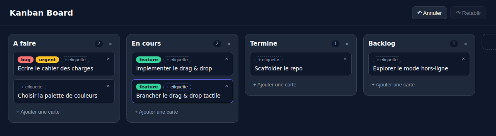
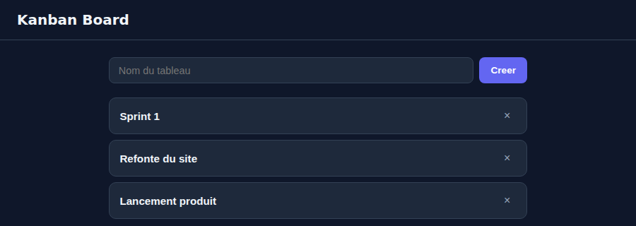

# Kanban Board

A Trello-style Kanban board -- columns, cards, drag & drop, undo/redo -- built
twice: a client-only Phase 1 (a pure reducer + `localStorage`) and a
full-stack Phase 2 (the same UI talking to a REST API backed by SQLite),
the same two-phase shape as this portfolio's `todo-list` project.

[](https://github.com/Elilou14/kanban-board/actions/workflows/ci.yml)
[](LICENSE)

**[Live demo (Phase 1)](https://elilou14.github.io/kanban-board/)**



## Why this project

Drag-and-drop boards are a classic state-management exercise: a lot of
small, order-sensitive mutations (add, rename, delete, reorder -- both
within and across containers) that all have to stay consistent, be
undoable, and survive a reload. This project's answer is a small Redux-style
reducer with every rule -- including what counts as a no-op -- concentrated
in one pure, exhaustively tested module, with an undo/redo history wrapper
built as a second, completely reducer-agnostic layer on top of it.

## Phase 1: client-only, with undo/redo

- **`web/board-state.js`** -- the reducer. A board is `{ columns: [{id,
  title, cardIds}], cards: {id: {id, title, description, labels}} }`.
  Every mutation (`ADD_COLUMN`, `RENAME_COLUMN`, `DELETE_COLUMN`,
  `MOVE_COLUMN`, `ADD_CARD`, `EDIT_CARD`, `DELETE_CARD`, `MOVE_CARD`) is one
  `case` in `boardReducer(board, action)`; the exported `addColumn`,
  `moveCard`, etc. are just ergonomic wrappers that build the action and
  dispatch it. An action that doesn't change anything (an unknown id, a
  no-op edit) returns the *exact same board reference* -- that convention
  is what lets undo/redo not waste a slot on nothing happening.
- **`web/history.js`** -- a generic `createHistoryReducer(reducer)` that
  wraps any reducer into `{past, present, future}` undo/redo. It doesn't
  know boards exist; it only knows to check for that same-reference no-op
  contract before pushing onto `past`.
- **`web/script.js`** -- the only place either of those get imported by
  something that isn't a test. Every UI action -- typing a title, dragging
  a card, hitting Ctrl+Z -- is a single `dispatch(action)` call; the DOM is
  never patched by hand, `render()` always rebuilds it from
  `history.present`. Drag & drop computes a drop index from the dragged
  element's siblings (with the dragged one filtered out) so it lines up
  exactly with how `MOVE_CARD`/`MOVE_COLUMN` index into the list *after*
  removing the item being moved. Ctrl+Up/Down/Left/Right on a focused card
  is a keyboard-only fallback for reordering, since HTML5 drag & drop has
  no built-in accessible equivalent. The board is saved to `localStorage`
  on every change (the undo/redo stacks themselves aren't -- each reload
  starts a fresh history over whatever board was last saved).

No confirm() dialogs anywhere, including on delete -- undo makes them
unnecessary.

```bash
# open web/index.html directly, or serve it:
cd web && python3 -m http.server 8000
```

## Phase 2: multi-board, backed by a real database

- **`server/db.js`** -- SQLite (`node:sqlite`, no dependency): `boards`,
  `columns`, `cards` tables, ordering as a plain integer `position` per row
  that gets renumbered within its scope (a board's columns, a column's
  cards) on every move. `getBoardDetail()` deliberately shapes its result
  exactly like Phase 1's board -- `{columns: [{id, title, cardIds}], cards:
  {...}}` -- the two sides agree on what a board *is*, even though nothing
  imports across the client/server boundary.
- **`server/server.js`** -- a dependency-free `http.createServer` REST API
  (`/api/boards`, `/api/boards/:id/columns`, `/api/columns/:id[/move]`,
  `/api/columns/:id/cards`, `/api/cards/:id[/move]`) plus a static file
  server for `server/public/`, so there's no CORS to deal with.
- **`server/public/`** -- a board picker (list/create/delete boards) plus
  the same drag-and-drop board UI as Phase 1, but every mutation goes
  through the API instead of a local reducer. There's deliberately **no
  undo/redo** here -- that's Phase 1's showcase; Phase 2's is a different
  state-management problem, keeping local state in sync with a server
  that's the real source of truth. Everything except drag & drop is
  request-then-refetch (await the API call, re-GET the board, re-render);
  drag & drop applies the move locally and re-renders immediately
  (optimistic), then fires the API call in the background and rolls the
  local board back -- with an error banner -- if that call fails.



```bash
npm start   # or: node server/server.js -- zero dependencies, nothing to install
# -> http://localhost:3000
```

Set `PORT` and `DB_PATH` to change the port or database file (defaults to
`3000` and `server/kanban.sqlite`).

## Running the tests

```bash
node --test
```

Runs everything -- `tests/` (the Phase 1 reducer and history wrapper) and
`server/tests/` (the SQLite layer and the REST API, the latter via real
`fetch()` calls against an ephemeral server on `:memory:`) -- 116 tests in
total.

## CI

`.github/workflows/ci.yml` runs the full suite above on every push and pull
request to `main`. `.github/workflows/deploy-pages.yml` publishes `web/`
(Phase 1) to GitHub Pages whenever it changes; Phase 2 needs an actual
server to run and isn't part of that deploy.

## License

MIT -- see [LICENSE](LICENSE).
